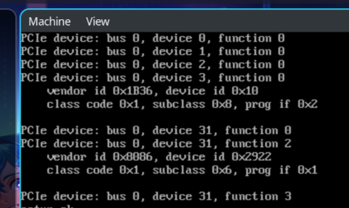

# LiOS Journal

## Programs

Some other parts of the file system can wait for now, such as some optimizations and importantly the ability to write files. With our newfound ability to read files, we can now turn our attention to reading and executing programs.

Since it's well-documented, decently simple and used on many Unix-like operating systems (Linux, FreeBSD, etc), I will use the [Executable and Linkable Format (ELF)](https://en.wikipedia.org/wiki/Executable_and_Linkable_Format). I won't implement shared objects since that is too complicated and programs in this basic operating system wouldn't be able to take advantage of them anyway.

### Side Quest

The time has finally come to fix the memory allocator problem I procrastinated for almost half a year: the fact that free and allocated linked lists in the virtual address allocator can each only use 1 page (4096 bytes), limiting the max number of notes to 169. This is quite bad for obvious reasons as we will probably be making more than 169 allocations and there is a real change for the free list to become extremely fragmented.

Before, those lists reside in higher half physical memory (above the 2GiB mark) so they are not "identity mapped" (speaking loosely: 0xFFFF800... + physical address is mapped to the physical address). This is complicated, and out of feat the 2GiB lower region becomes filled up with random junk and causing an out of memory situation. Fortunately it looks like I was too paranoid and right now `kmalloc` is used to allocate a whopping 16 pages, or 64 kilobytes, out of 2097152 bytes of lower memory available. For this reason the free and allocated lists will not come directly from the `kmalloc` allocator.

### Side Quest #2

Bochs is different from QEMU, and it sets up the memory map in a different way that causes our program to break. Here is the memory map produced by QEMU:
```
INFO:      base_addr = 0x0, length = 0xA0000, type = Available, 0x32050
INFO:      base_addr = 0x100000, length = 0x700000, type = Available, 0x32068
INFO:      base_addr = 0x800000, length = 0x8000, type = NVS, 0x32080
INFO:      base_addr = 0x808000, length = 0x3000, type = Available, 0x32098
INFO:      base_addr = 0x80B000, length = 0x1000, type = NVS, 0x320B0
INFO:      base_addr = 0x80C000, length = 0x5000, type = Available, 0x320C8
INFO:      base_addr = 0x811000, length = 0xEF000, type = NVS, 0x320E0
INFO:      base_addr = 0x900000, length = 0x7E303000, type = Available, 0x320F8
INFO:      base_addr = 0x7EC03000, length = 0xC1000, type = Reserved, 0x32110
INFO:      base_addr = 0x7ECC4000, length = 0x829000, type = Available, 0x32128
INFO:      base_addr = 0x7F4ED000, length = 0x100000, type = Reserved, 0x32140
INFO:      base_addr = 0x7F5ED000, length = 0x100000, type = ???, 0x32158
INFO:      base_addr = 0x7F6ED000, length = 0x80000, type = Reserved, 0x32170
INFO:      base_addr = 0x7F76D000, length = 0x12000, type = ACPI Reclaimable, 0x32188
INFO:      base_addr = 0x7F77F000, length = 0x80000, type = NVS, 0x321A0
INFO:      base_addr = 0x7F7FF000, length = 0x6C3000, type = Available, 0x321B8
INFO:      base_addr = 0x7FEC2000, length = 0x4000, type = Reserved, 0x321D0
INFO:      base_addr = 0x7FEC6000, length = 0x2000, type = NVS, 0x321E8
INFO:      base_addr = 0x7FEC8000, length = 0x2C000, type = Available, 0x32200
INFO:      base_addr = 0x7FEF4000, length = 0x84000, type = Reserved, 0x32218
INFO:      base_addr = 0x7FF78000, length = 0x88000, type = NVS, 0x32230
INFO:      base_addr = 0xE0000000, length = 0x10000000, type = Reserved, 0x32248
INFO:      base_addr = 0x100000000, length = 0x180000000, type = Available, 0x32260
INFO:      base_addr = 0xFD00000000, length = 0x300000000, type = Reserved, 0x32278
```

And here is the memory map produced by Bochs:
```
INFO:      base_addr = 0x0, length = 0x9F000, type = Available, 0x948C90
INFO:      base_addr = 0x9F000, length = 0x1000, type = Reserved, 0x948CA8
INFO:      base_addr = 0xE8000, length = 0x18000, type = Reserved, 0x948CC0
INFO:      base_addr = 0x100000, length = 0x7FEF0000, type = Available, 0x948CD8
INFO:      base_addr = 0x7FFF0000, length = 0x10000, type = ACPI Reclaimable, 0x948CF0
INFO:      base_addr = 0xFFFC0000, length = 0x40000, type = Reserved, 0x948D08
```

The last number in every line represents the location of the variable containing the information about that memory section. In QEMU world, the memory map variable is placed around 0x32000, and 0x32000 is in the first "Available" zone. We do not use the first Available zone because it is too low.

However, Bochs placed the memory map variable in the second Available zone, starting 0x100000. Unfortunately, this is the part of memory we will use, and the PMM initialization will manipulate parts of this piece of memory. This manipulation has broken the memory map structure, resulting in a page fault.

The solution to this is: find the start and end of the structure provided by multiboot. For every Available section, check if there is an overlap between that zone and the multiboot structure area. If so, cut it out. This means calling `pmm_add_block` twice.

## File system

I have decided to use FAT32. It is quite simple (compared to ext2 and others) while also being quite capable (unlike FAT12/16, except for the 4GB file size limit) and widely supported on existing operating systems.

The LiOS implementation of FAT32 will NOT support:
- directories (this means we are capped at [65536](https://serverfault.com/a/1013729) files but I will probably never get to that point)
- long file names
- more than 1 sector per cluster

### Reading

We can now read files from a FAT32 formatted volume. I will think about what a good layer of abstraction for this is, and what the interface with the kernel or user programs would look like.

Currently, we can do the following:
 - create a new file
 - read information about a file, getting its size and starting cluster
 - read a file to memory, given its cluster and size (which have been retrieved from the previous step)

### Creating the disk image

Ideally I would like the disk image to have partitions which are formatted in our chosen file system, and for us to be able to mount that file on our local computer for reading and writing.

1. Create the disk `qemu-img create -f raw disk.img [size]`
2. Add a GUID Partition Table (GPT) `parted disk.img mklabel gpt`
3. Create a FAT32 partition `parted disk.img mkpart primary fat32 0% 100%`
4. Set up a loop device `sudo losetup -Pf --show disk.img`
5. Format the partition (`parted` only creates) `sudo mkfs.fat -F 32 /dev/loopNp1`

### Reading and writing

To read and write for testing (i.e. from my real computer) simply set up the loop device (`sudo losetup -Pf --show disk.img`) and udiskie will automatically mount it.

### GPT

Before we can even get to implementing/programming the file system, we need to first read the GUID Partition Table (GPT) to find a list of partitions, which is in Logical Block Address (LBA) 1, which by default is 512 bytes. The 32 LBAs from 2 to 33 are used to store partition entries. Each partition entry is 128 bytes so each LBA stores 4 partitions, so with 32 LBAs a maximum of 128 partitions is possible.

LiOS has two very major restrictions on partitioning. Only the Microsoft basic data partition (which uses FAT) can be used, and the disk must only have one such Microsoft partition, which will be used by the OS for storage. This makes it a lot easier for me.

## Programming the NVMe Device

After locating the NVMe base address, we need to create the I/O Submission and Completion Queues, which involves sending commands to the device using the Admin Submission Queue. This entails configuring the Controller Capabilities field (CC), restarting the controller, and sending two commands. Base spec P138 and onwards is quite useful for decoding the posted completion queue entry.

This step was quite confusing as NVMe is quite a complex standard, but after asking around the internet and reading the manual I have figured out how to do this.

I have also figured out how to send the "read" and "write" commands through the created IO submission queue. This allows us to read and write to a storage device, which is pretty huge. That by itself is not very useful, as we need a few more abstractions to have a properly functioning filesystem.

Something quite neat here is because our `vmalloc` heap allocator works in sections of 16 bytes, we do not need to worry about NVMe's requirement of dword (4 byte) alignment for physical region page (PRP).

Implemented in `309d017`.

## Enumerate Devices

This works. We are able to make QEMU attach an NVMe drive to the emulated system, the OS can find the PCI configuration spaces using memory mapped IO, list the devices and are able to find this attached drive. It shows up as class code `0x1`, subclass `0x8`, prog IF `0x2`, which is an NVM Express Mass Storage Controller according to [this table](https://wiki.osdev.org/PCI#Class_Codes).



## File System -- Big Picture

Storage and filesystem! Unfortunately there's a list of very confusing and hard to understand steps needed...

1. enumerate PCIe devices
  - to do this we need to find the MCFG ACPI table
  - to find that we need to find the RSDT/XSDT
  - to find that we need to find the Root System Description Pointer (RSDP)
  - to find that it depends on whether we're booted in BIOS of UEFI
     - modern hardware uses UEFI so we probably should make the emulator use UEFI too
     - but QEMU uses BIOS... need to somehow include OVMF so we can boot in UEFI
  - if we're in UEFI, which we should be, GRUB2 will provide us with the EFI system table
  - basically: **make QEMU use UEFI --> find EFI system table --> find RSDP --> find RSDT or XSDT --> find MCFG ACPI --> read memory mapped io base address --> read PCIe devices**
2. write an NVMe driver...
3. filesystem (such as FAT or ext2)
4. (write a layer of abstraction, the virtual filesystem (VFS), but I probably won't)

## Problems with real harwdare

I had some problems booting on real hardware which I asked about on the osdev forums [here](https://forum.osdev.org/viewtopic.php?p=349986). There were a number of serious problems...

- Stack pointer (`esp`/`rsp`) should point to the top of stack not the bottom.
- Linked list created in `pmm.c` is not terminated with a zero, and in case the amount of physical memory is less than 2GB it will attempt to dereference some uninitialized garbage which will cause either a page fault or general protection fault.
- Virtual memory manager's `alloc_list` has the same problem.
- `[page structure]_set_addr` in `page.c` does not clear/zero the address before setting the new one.
- When allocating a new page structure, that memory/page is not initialized, which may lead to a nonpresent structure being read as present. I made a function called `kcalloc_page` which initializes it to zero and use this for creating new page structures instead.
- Memory used to store printed chars in `vga.c` is also uninitialized, use a new `vcalloc` function instead.

As a result, LiOS can now run on real hardware!

Implemented in `dbbddc0`.

## Redesigned page frame allocation

There is a nasty physical memory allocation bug. In the past we assumed that the available physical memory is contiguous and starts at the end of the kernel. This is of course not the case as there are a bunch of random UEFI, architecture or other sections fragmenting our available memory. Fixed by rewriting how the PMM is initialized (by adding "blocks" of available memory instead of all at once).

Implemented in `9a0aebe`.

## VGA graphical mode

In the past, we used VGA text mode. This was a nice system. We could just write an ASCII code to a certain memory offset and that letter is displayed automatically.

VGA text mode is no longer supported when booting with UEFI and only works with legacy BIOS. Unfortunately, modern hardware manufacturers do not want to support legacy BIOS and only support UEFI (our school computers are one such case). So if LiOS has any hope of working on real hardware we have to switch to VGA graphical mode.

In VGA graphical mode you draw pixels instead of letters, and I have no interest in creating a graphical user interface, so the interface will still be terminal based. We will have to download a PC Screen Font (PSF), decode it to figure out which pixels need to be drawn for each characters, and draw them.

We have no filesystem currently, so we can't just read a PSF file. We will instead hard code the font directly in the C code. Other methods described [here](https://wiki.osdev.org/Drawing_In_a_Linear_Framebuffer) involve quering the BIOS in real mode, fetching them from VGA registers, or linker trickery. This sounds really complicated and hard coding sounds simple enough.

Steps:

1. download 8x16 VGA font [here](https://www.zap.org.au/projects/console-fonts-zap/)
2. use [this](https://github.com/talamus/rw-psf) tool to convert PSF to plain text
3. write a script (util/psftxt2ints.cpp) to convert plain text to integers

Implemented in `1b32127` and `45ee8c1`.

## Linux-esque memory allocation scheme

Right now there the kernel memory system is like this:

1. kernel asks heap allocator for some space
2. heap allocator checks if it has enough free memory. if yes, return the memory. if not, ask the virtual memory manager for more
3. *virtual memory manager looks through its linked list to find a free block (blocks are measured in 4KiB pages)*
4. *once it finds one, ask the physical memory manager for that number of pages*
5. *map the virtual memory to the physical memory*
6. go back to step 2

That is a problem. To map pages you need to create page structures (pml4, page directory pointer table, page directory table, page tables) which you also need to allocate. Here is the problem: we obviously cannot use paging to map the page structures to a physical page frame, because then there is a horrible recursion which will not end. So instead we use the fact that the first 2GiB of memory is mapped to the highest 2GiB of the virtual address space. But steps 3-5 will mess this up: what if `page_frame_phys_addr + KERNEL_OFFSET` (which should be the virtual address of the page frame) is already given away by the virtual memory manager?

But what we have before is fine for "normal" kernel structures where physical address does not matter. In Linux this is called `vmalloc`. (In LiOS it is currently called `kmalloc`, confusingly.)

Linux also has `kmalloc`, which allocates *physically* contiguous memory. We will implement a simple version of this, without a heap manager because it's only used for making paging structures, each of which is 4KiB = 1 page.

Implemented in `c52fc2f`.

## Everything before

I wrote most of this stuff during exam week last year and over the summer. This includes

- A physical memory manager (allocates 4096 byte pages of physical memory)
- A virtual memory manager (allocates sections of virtual memory in blocks)
- Heap allocator (manages free virtual memory (which has to correspond to blocks of physical memory) and gives them away in any size (specifically, multiples of 4 bytes))
- *VGA text mode* frame buffer, which cannot be used on UEFI hardware, which has to be supported to boot on modern hardware
- Keyboard interrupts, obviously

